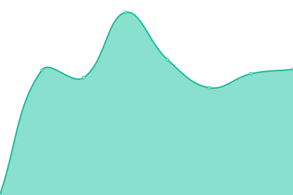
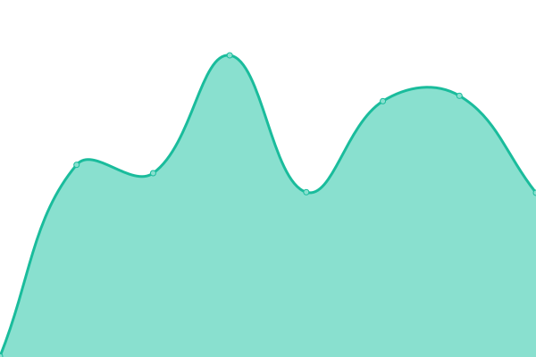
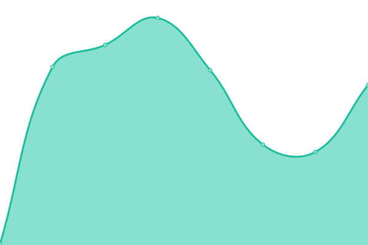
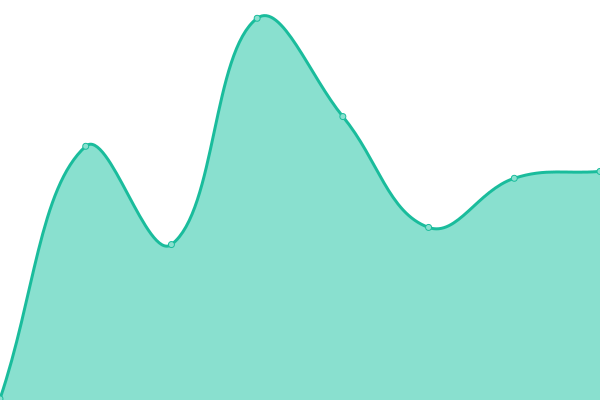

# [📈 Live Status](https://demo.upptime.js.org): <!--live status--> **🟩 All systems operational**

This repository contains the open-source uptime monitor and status page for [copoer](https://ooper.space/), powered by [Upptime](https://github.com/upptime/upptime).

With [Upptime](https://upptime.js.org), you can get your own unlimited and free uptime monitor and status page, powered entirely by a GitHub repository. We use [Issues](https://github.com/copoer/upptime/issues) as incident reports, [Actions](https://github.com/copoer/upptime/actions) as uptime monitors, and [Pages](https://demo.upptime.js.org) for the status page.

<!--start: status pages-->
<!-- This summary is generated by Upptime (https://github.com/upptime/upptime) -->
<!-- Do not edit this manually, your changes will be overwritten -->
<!-- prettier-ignore -->
| URL | Status | History | Response Time | Uptime |
| --- | ------ | ------- | ------------- | ------ |
|  [Prod](https://app.ottooptics.io/health-check/) | 🟩 Up | [prod.yml](https://github.com/cooperotto/uptime/commits/HEAD/history/prod.yml) | 

 551ms
     
 | 

<a href="https://status.ottooptics.io/history/prod">100.00%</a>
    

|  [Demo](https://demo.ottooptics.io/health-check/) | 🟩 Up | [demo.yml](https://github.com/cooperotto/uptime/commits/HEAD/history/demo.yml) | 

 1586ms
     
 | 

<a href="https://status.ottooptics.io/history/demo">99.82%</a>
    

|  [Dev](https://dev.ottooptics.io/health-check/) | 🟩 Up | [dev.yml](https://github.com/cooperotto/uptime/commits/HEAD/history/dev.yml) | 

 1570ms
     
 | 

<a href="https://status.ottooptics.io/history/dev">99.05%</a>
    

|  [Front Page](https://www.ottooptics.io/) | 🟩 Up | [front-page.yml](https://github.com/cooperotto/uptime/commits/HEAD/history/front-page.yml) | 

 477ms
     
 | 

<a href="https://status.ottooptics.io/history/front-page">100.00%</a>
    

|  [Otto Content](https://app.ottocontent.ai/) | 🟩 Up | [otto-content.yml](https://github.com/cooperotto/uptime/commits/HEAD/history/otto-content.yml) | 

 1838ms
     
 | 

<a href="https://status.ottooptics.io/history/otto-content">100.00%</a>
    

|  [Glitch Tip](https://glitchtip.ottooptics.io/) | 🟩 Up | [glitch-tip.yml](https://github.com/cooperotto/uptime/commits/HEAD/history/glitch-tip.yml) | 

 216ms
     
 | 

<a href="https://status.ottooptics.io/history/glitch-tip">100.00%</a>
    

<!--end: status pages-->

[**Visit our status website →**](https://demo.upptime.js.org)

## 📄 License

- Powered by: [Upptime](https://github.com/upptime/upptime)
- Code: [MIT](./LICENSE) © [Anand Chowdhary](https://anandchowdhary.com), supported by [Pabio](https://pabio.com)
- Data in the `./history` directory: [Open Database License](https://opendatacommons.org/licenses/odbl/1-0/)
